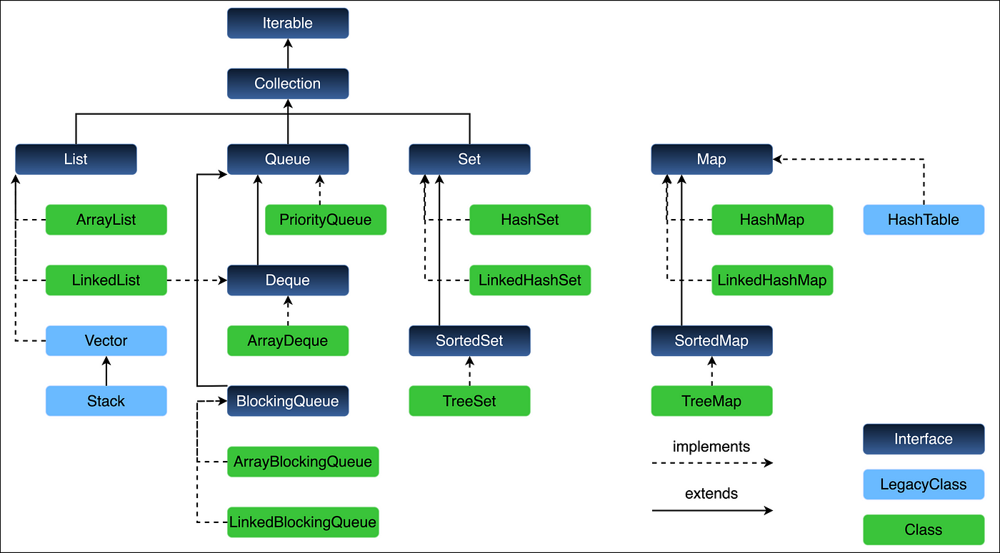
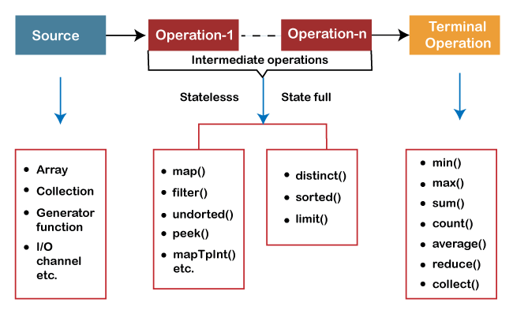

### Collections Framework
<hr />



Implementations
List: ArrayList, Linked List
<hr/>

#### Collection(I) interface

```java
public interface Collection<E> extends Iterable<E>
{
int size();
boolean isEmpty();
boolean contains(Object o);
boolean add(E e);
boolean remove(Object o);
Iterator<E> iterator();
Object[] toArray();
T[] toArray(T[] arr);
Stream<E> stream();
Stream<E> parallelStream();

// Bulk Operations
boolean containsAll(Collection<?> c);
boolean addAll(Collection<? extends E> c);
boolean removeAll(Collection<?> c);
boolean removeIf(Predicate<? super E> filter);
}

```


<hr/>
#### Iterable(I) interface
* boolean hasNext();
* E next();
* void remove();
<hr/>

### toArray() method
* to convert given collection to arrays
  * method1: Object[] toArray()
  * method2: T[] toArray(T [])

<hr/>

### Streams in Java
* intermediate function, terminal function
* NO storage, pipeline of functions, can be infinite, can be parallelized
* can be created from collections, arrays, Files lines, methods in stream, IntStream, etc.


### List Interface Methods
* get(indx)
* set(index, value)
* indexOf(o)
* listIterator()
  * hasPrevious()
  * previous()
  * add()
  * set()
  * nextIndex()
  * previousIndex()
* listIterator(int index)
* remove(int index)

#### ArrayList
  *  we can create an arraylist from capacity as well and this is cache friendly random access
  *  internally it uses array only
  *  we can set the size by ensure capacity
  * Amortized time complexity for inserting n+1 items
    * ø(1)+ø(1)...+ø(1)+ø(n) / (n+1)
    * (ø(n) + ø(n)) / n+1
    * ø(1)
  * methods:
    * add(object)
    * add(index, object)
    * contains(object)
    * remove(index)
    * remove(object)
    * get(index)
    * set(index, obj)
    * indexOf(obj) - returns first occurrence
      * returns -1 if not found
    * lastIndexOf(obj)
      * returns -1 if not found
    * clear()
    * isEmpty()
    * ArrayList Traversal
      * extended for loop
      * Iterators
        * ```Iterator it = al.iterator()```
        * we will not receive CCM exception
      * using forEach method
        * ```al.forEach(x->System.out.println(x));```

<hr />

### Linked List

* Linked list implements List, Queue and Deque as well
* implemented using doubly linked list
* consumes no extra space
*  Methods:
  * get(index)
  * add(o)
  * add(index, o)
  * remove(index)
  * remove(x)
  * contains(x)
  * set(index, x)
  * indexOf(x)
  * lastIndexOf(x)
  * isEmpty()

* methods from Queue interface:
  * add()
  * remove() - front of LL
  * element()
  * offer()
  * poll()
  * peek()
* Deque interface methods (Doubl ended queue)
  * addFirst()
  * removeFirst()
  * getFirst()
  * addLast()
  * removeLast()
  * getLast()
  * offerFirst()
  * pollFirst()
  * peekFirst()
  * offerLast()
  * pollLast()
  * peekLast()

* LL equivalent methods:
  * add(x) addLast(x)
  * offer(x) offerLast(x)
  * remove() removeFirst()
  * poll() pollFirst()
  * element() getFirst()
  * peek() peekFirst()


<hr />

### Queue
* Queue in java is an interface
  * in java Queue is implemented by
    * LinkedList (DLL)
    * ArrayDeque (Array implementation)

* Functions that do not throw exceptions
  * peek()
  * offer()
  * poll()
* Function that throw exceptions
  * element()
  * add()
  * remove()


<hr />

### Deque
* Deque allows insertion and deletion at both the ends
* implemented by LinkedList and ArrayDeque
  * methods - don't throw exceptions
    * offerFirst() - return boolean
    * offerLast() - return boolean
    * pollFirst()
    * pollLast()
    * peekFirst()
    * peekLast()
  * methods - throw exceptions
    * addFirst()
    * addLast()
    * getFirst()
    * getLast()
    * removeFirst()
    * removeLast()
  * Traversal
    * using iterator
      * also we can use descending iterator for traversing from last to first
      * ```Iterator it = dq.descedingIterator()```
    * extended for loop
* deque supports queue functions also but not reommended to use them

### ArrayDeque

* Collection -> Queue -> Deque -> ArrayDeque
* ArrayDeque is preferred over stack for single threaded environment
* ```ArrayDeque<Integer> ad = new ArrayDeque<Integer>();```
* methods:
  * push()
  * peek()
  * pop()
  * offer() - no exceptions
  * poll() - no exceptions
  * peek() - no exceptions
  * add()
  * remove()
  * element()
  * **supports all deque methods**
* arrayDeque internally designed for using circular like array

### priorityQueue

* implemented minheap internally
* for maxheap, pass the ```Collections.reverseOrder()``` in the constructor

<hr />

### Set Interface
* some methods
  * union
    * s1.addAll(s2)
  * Intersection
    * s1.retainsAll(s2)
  * Difference
    * s1.removaAll(s2)

### Hashset

* methods
  * add()
    * ignores if the item already available
  * contains()
  * iterator()
  * clear()
  * isEmpty()
  * size()

### LInked HashSet

* child class of HashSet
* Since Hashset using Hashing, then order is not preserved
* LinkedHashSet uses hashing + Doubly Linked List, so it guarantees ordered traversal
* Use LinkedHashSet only if order is to be preserved

### TreeSet

* Internal implementation self-balancing binary search tree
  * contains()
  * remove()
  * iterator()
* It implements SortedSet
* Other specific methods 
  * s.lower(5)
  * s.higher(5)
  * s.floor(5)
  * s.ceiling(5)
  
<hr />

### Map Interface

 * HashMap -> LinkedHashMap
 * SortedMap(I) -> NavigableMap(I) -> TreeMap
 * methods in Map interface:
   * V put(K key, V value)
   * V get(Object key)
   * boolean isEmpty()
   * V remove(Object key)
   * boolean containsKey(key)
   * boolean containsValue(val)
   * V replace(key, value)
   * int size()
   * Set<K> keySet();
   * Collection<v> values();  // returns a collection
   * Set<Map.Entry<K,V>> entrySet()
   * v getOrDefault(key, default)
   * void clear()

### LinkedHashMap

* special constructor
  * (initialCapacity, loadFactor, AccessOrder) - For LRU cache implementation

### TreeMap

* Items will be stored in sorted order
  * specific methods
    * higherKey()
    * lowerKey()
    * floorKey()
    * ceilingKey()
  * methods for entries
      * higherEntry()
      * lowerEntry()
      * floorEntry()
      * ceilingEntry()

<hr />

### Strings
* UTF-16 used for storing characters
* 3 classes available
  * new String()
  * new StringBuffer() - threadsafe
  * new StringBuilder() - not threadsafe
* String methods
  * indexOf() - returns -1 
  * contains() boolean
  * charAt()
  * compareTo()
    * Do lexicographical comparison
    * 0 if both the chars equal
    * 1 if the s1 is less than s2
    * -1 if the s1 is higher than s2
  * substringI()
  * concat()

### StringBuffer and StringBuilder

* Buffer - ThreadSafe but less performance
* Builder - Not ThreadSafe but high performance

* Methods:
  * length()
  * chatAt()
  * substring()
  * indexOf()
  * lastIndexOf()
  * compareTo()
  * chars() - streams of integers

* New methods
  * append(x)
  * insert(offset, x)
  * setCharAt(index, c)
  * reverse()
  * deleteCharAt(index)
  * delete(start, end)
  * capacity()
  * replace(start,end,str)


<hr />

### Comparable Interface

* all of the wrapper classes are implementing Comparable interface
```
  public interface Comparable<T> {
  public int compareTo(T o); 
  }
```

* if ordering is custom, then we need to implement Comparator interface

### Comparator Interface

* to compare other than natural sorting order
* it is functional interface
```
public interface Comparator<T> {
int compare(T t1, T t2);
}
```

* Methods:
  * int compare(t1, t2)
  * comparing()
  * thenComparing()
  * naturalOrder()
  * reversed()
  * reversedOrder()
  * nullFirst()
  * nullLast()

<hr />

### Arrays Class

* Methods:
  * asList() - creates a list using array(creates a wrapper) -  we cant add or remove to the list 
  * toString()
  * equals()
  * mismatch()
  * compare()
  * fill()
  * sort()
  * stream()
  * binarySearch()

<hr />

### Collections Class:

* Collection methods
  * min(c)
  * max(c)
  * disjoint(c1,c2)
  * frequency(c, obj)
* List Methods
  * binarySearch(l, key)
  * copy(dest, src)
  * fill(l, obj)
  * indexOfSubList(src, target)
  * lastIndexOfSubList(src, target)
  * replaceAll(l, old, new)
  * reverse()
  * rotate(l, dist)
  * sort(l)
* other methods
  * reverseOrder()
  * synchronizedList(l)
  * synchronizedMap(m)
  * synchronizedSet(s)
  * unmodifiableList(l)
  * unmodifiableMap(m)
  * unmodifiableSet(s)