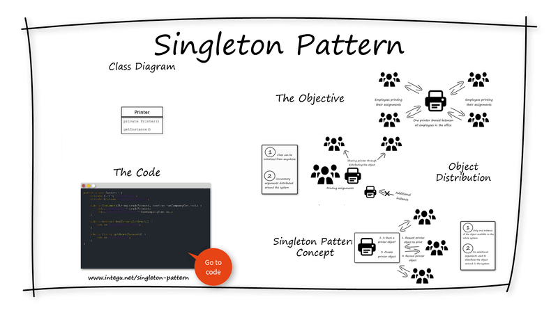
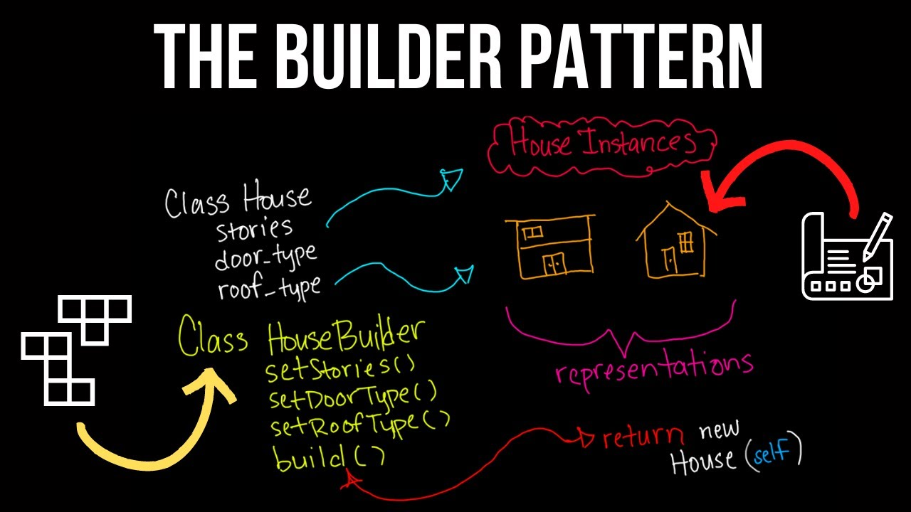
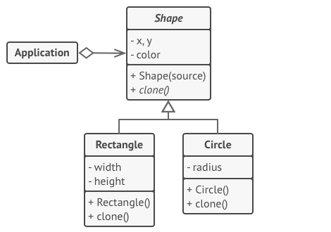
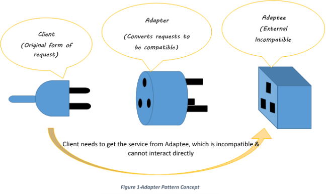
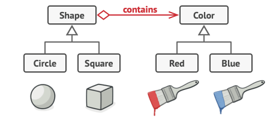
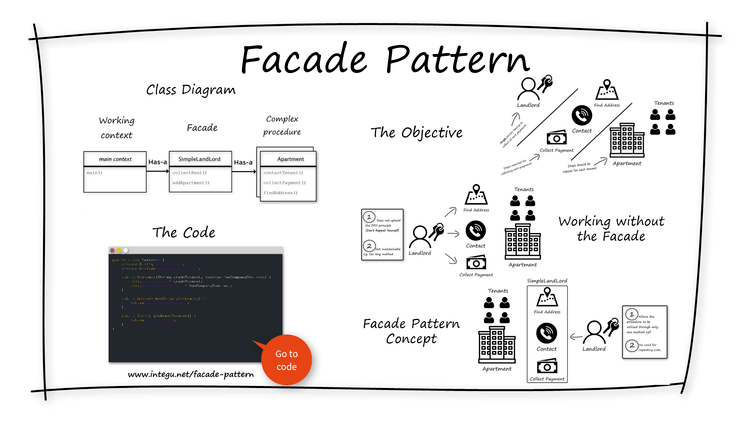
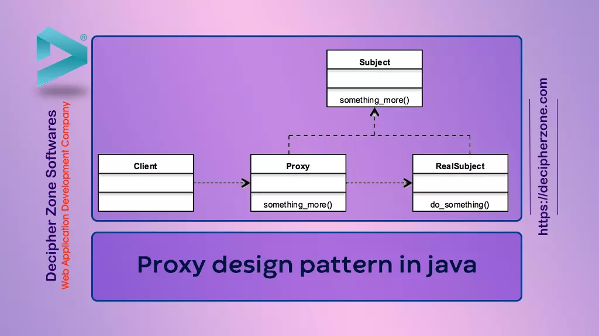
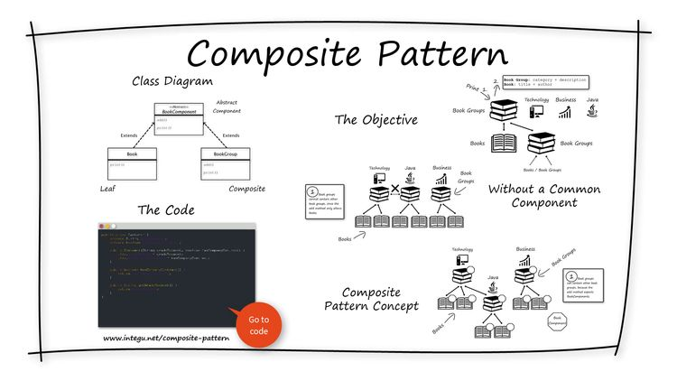
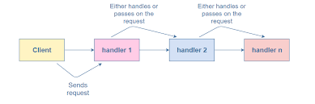

### SOLID Principles
  * S - Single Responsibility (single functionality)
  * O - Open Closed (class should be closed for modification)
  * L - Liskov Substitution
  * I - Interface Segregation
  * D - Dependency Inversion

### Creational Patterns

#### Singleton pattern
* Example: DB Connection
* Leverage static method and synchronized block
* readResolve() method will be called by jvm during the deserialization to ensure that the same object is used
* Also , using reflection we can change the visibility of the private constructor and can create an instance
* 

#### Factory design pattern

 * Factory : As name suggest it is factory where we can create objects.
 * Since it creates object it falls in creational design pattern
 * Factory pattern has  two important element in its design.

 * 1. Interface/Abstract class : This is base element for which we are making factory i.e. we are going to get object of this type
    * In this case it is "OperatingSystem" which has type available Windows and Linux.

 * 2. Factory : This will have nothing but Object creation logic. Let's say as a library you introduce one more subtype that is
    * MacOperatingSystem. Now your caller is automatically extended this facility of third type , also we have taken responsibility of
 * creating of object.

 * In java this pattern is heavily used:
 * 1. Calendar.getInstance : Calendar is abstract class amd based on Locale and Timezone we provided it is giving calendar instance.
 * Note in this case we really don't know what type of calendar we got.
 * 2. In reflection Class.forname : the type of class you pass it gets loaded.
 * Best link to learn java and patterns used : https://stackoverflow.com/questions/1673841/examples-of-gof-design-patterns-in-javas-core-libraries

#### Builder design pattern

* will return the same object in the builder hierarchy
* optionally we can add the properties to have in the object
* finally it will have the build() method
* 

#### Prototype design pattern

* Prototype pattern comes into creational design pattern. As the name suggest
* As the name state prototype meaning creating object from some  reference which we already have.
* It is mainly useful when we have Object which is already created with costly operations at that time we keep that object after creation whenever we need
* new object we simply clone object and tweak or do slight modification in the object and use it.
* In addition to this it is useful when we want to hide the creation of object.
* Here when we say cost of creation which means lets say your object got created by some database operations or io operation.
*
* In cloning its totally upto implementor whether we want to have shallow copy or depp copy while cloning.
*
* There are mainly three components involved in simple Prototype design pattern.
* 1. Prototype : Type of class which has clone method and a super class of all prototypes.
* 2. Sub-Classes - Which implements cloning.
* 3. Client which uses this subclass and clone
* In this additionally you can maintain registry which helps to give you specific prototype.
* In our example lets say we have vehicle and which different types of vehicle , so you can store in
* vehicle registry with different type of vehicles.
* https://simpletechtalks.com/prototype-design-pattern/
* http://www.jasondeoliveira.com/2011/05/tutorial-common-design-patterns-in-c-40_07.html
* https://reactiveprogramming.io/blog/en/design-patterns/prototype
* 

### Structural Patterns

#### Adapter design pattern

* Adapter design pattern is one of the structural design pattern and its used so that two unrelated interfaces can work together. 
* The object that joins these unrelated interface is called an Adapter
* 
* Adapter patterns comes under structural pattern as it deals with how classes are interacting.
* As name suggests adapter pattern is used adapt two different incompatible system.
*
* Adapter pattern also helps and be connector between your system and some third party or legacy system.
* For example your system expects data in one format to process and third party sends in one format.
* Example : Consider you have to invoke some third party soap service which is xml base however your system is built on JSON
* with some advanced fields at that time you create JSON-to-XML adapter which will help to interact with thirdparty.
* Adapter pattern can be achieved in two ways :
* 1. Class Level: class level mean to adapt something you are extending and doing inheritance of that class.
* 2. Object level : Object level mean you keep has-a relationship with class rather doing tight coupling in system.
*
* One of the example is we know java supports both array and list to store data. Now you have legacy system
* which is using array and you want to use collection functionalities to do so we have to convert, so Arrays.asList work as adaper
* between array to list and then use collections.
*
* A java.io.InputStreamReader translates a byte stream into a character stream, and a java.io.OutputStreamWriter translates a character stream into a byte stream. These classes exemplify the Adapter pattern.
* In particular, they change input/output stream interfaces to the required reader/writer interfaces
* https://cecs.wright.edu/~tkprasad/courses/ceg860/paper/node26.html
*
* In this example we will see that Swiggy is selling food products now suddenly lockdown arise
* and they thought to provide service of delivering grocery items for sometime so they write adapter which
* helps them to convert similar to food item without touching their food delivery business.

#### Bridge design pattern
* 
* Bridge Pattern : Bridge pattern is also structural pattern similar to adapter,facade.
* As the name suggest Bridge - we are creating bridge between two implementation using composition rather than going by
* inheritance.  While dealing with abstraction we usually create inheritance hierarchies to achieve abstraction.
* However inheritance is not a good option everytime as it creates tightly couple application and one change in base class
* cause issues in whole inheritance hierarchy.
*  This means to create a bridge interface that uses OOP principles to separate out responsibilities into different abstract classes.
* 
* The bridge pattern does it by separating the abstraction and the implementation in separate class hierarchies. The bridge between the class hierarchies is achieved through composition.
*
* When we want a parent abstract class to define the set of basic rules, and the concrete classes to add additional rules
*
* When we go via inheritance it keeps growing the hierarchy. For example we have Shape  class
* which has Rectangle and Triangle. And each shape has two color variants red and yellow so you extended and Created RedRectangleShape and YellowRentangleShape and same triangle.
* So we have now this 4 different variants of shape , consider you decided to expand for Blue color and Circle shape. So your classes keep getting increased.
*
* Rather lets implement bridge pattern which says separate out function in different hierarchies one color and one shape
* So your shape has a color and uses it . So you can keep expanding your system now.
*
* Major components to achieve bridge patterns are :
* 1. Abstraction : This is main abstract class which client uses.
* 2. RefinedAbstraction - This is the class which extends abstraction
* 3. Implementor : Interface for the implementation hierarchy.
* 4. Concrete Implementor - Implementation of the implementor.
*
* https://howtodoinjava.com/design-patterns/structural/bridge-design-pattern/
* https://springframework.guru/gang-of-four-design-patterns/bridge-pattern/

#### Decorator design pattern

* Decorator - It is a design pattern categorized in structural pattern. It helps to decorate the object meaning
* It basically keeps expanding behaviour of the object.The decorator design pattern is used to change an object’s functionality during runtime.
* Other instances of the same class will be unaffected, therefore each object will have its behavior changed.
*
* Since we can keep supporting adding new decorator we are getting dynamic object extension.
* After all we are creating stack of wrapper , certain system becomes so coupled that it becomes difficult to
* remove certain decorators.

#### Facade design pattern

* Facade pattern : This is also a structural pattern where it defines how classes needs to be structured in a way that
* for complex functionalities there is single entry point to that function.
* We should use facade pattern when we have complex subsystems , calling each leads to a single operation for client.
* In this case we should introduce facade which helps to do interaction with all this subsystem and gives us single output,
* Facade pattern basically adds one level of abstractions in the system.
*
* To implement facade you have to write one class which interacts with other services in down stream.

#### Proxy design pattern

* Proxy pattern : Proxy pattern is structural pattern. We use proxy when we don't want to expose real object and provide proxy object to deal with.
* Many times when you are dealing with remote servers and do lookup from the naming server it provides you proxy object from remote server not actual one.
* Even in hibernate if remember we have concept of lazy loading where whenever we load data from db we get proxy object of
* database and return it however if we get it then only it gets loaded from database. This is one of the best example of proxy object.
*
* Another example can be Spring AOP where AOP objects are proxy and treated on advice aspects.
*
* Different type of proxies are :
* 1. Remote proxy : When you are dealing with remote system , you require remote object to interact with the system. Usually in past it get used in ejb where beans gets created in container
* and client gets object using JNDI system.
* 2. Virtual proxy :Delay the object creation until it is required, as explained hibernate uses this.
* 3. Protection proxy : this proxy is used when we are dealing with security system where before invoking system implementation we want to check access.
* 4. Snart proxy - Perform some additional steps before accessing object.

* Proxy pattern has mainly three components :
* 1. A common interface
* 2. Real Class
* 3. Proxy class - this uses the realclass and it is proxy of real class.
*
* https://www.javadevjournal.com/java-design-patterns/proxy-design-pattern/

#### Composite design pattern

* Composite pattern : Composite is a structural design pattern that lets you compose objects
* into tree structures and then work with these structures as if they were individual objects.
*
* Reference: https://www.baeldung.com/java-composite-pattern
*            https://refactoring.guru/design-patterns/composite
*
* It can be viewed as a tree structure made up of types that inherit a base type,
* and it can represent a single part or a whole hierarchy of objects.
*
* Component – is the base interface for all the objects in the composition. It should be either an interface
* or an abstract class with the common methods to manage the child composites.
* Leaf – implements the default behavior of the base component. It doesn't contain a reference to the other objects.
* Composite – has leaf elements. It implements the base component methods and defines the child-related operations.
* 
* 

#### Chain of Responsibility design pattern

* Wikipedia defines Chain of Responsibility as a design pattern consisting of “a source of command objects 
* and a series of processing objects”.
* Each processing object in the chain is responsible for a certain type of command, and the processing is done, 
* it forwards the command to the next processor in the chain.

* Chain of Responsibility is a behavioral design pattern that lets you pass requests along a chain of handlers.
* Upon receiving a request, each handler decides either to process the request or to pass it to the next handler in the chain.
*
* The Chain of Responsibility pattern allows a number of classes to attempt to handle a request independently.
*
* Reference: https://refactoring.guru/design-patterns/chain-of-responsibility

### Behavioral Design Patterns

#### Command design pattern

* Command is a behavioral design pattern that turns a request into a stand-alone object that contains all
* information about the request. This transformation lets you pass requests as a method arguments, delay
* or queue a request’s execution, and support undoable operations.
*
* Reference: https://refactoring.guru/design-patterns/command
* 			  https://www.baeldung.com/java-command-pattern

#### Iterator Design Pattern

* Refer the collection iterators

#### Mediator Design Pattern

* In object-oriented programming, we should always try to design the system in such a way that components are loosely coupled and reusable. This approach makes our code easier to maintain and test.
* In real life, however, we often need to deal with a complex set of dependent objects. This is when the Mediator Pattern may come in handy.
* The intent of the Mediator Pattern is to reduce the complexity and dependencies between tightly coupled objects communicating directly with one another. This is achieved by creating a mediator object that takes care of the interaction between dependent objects. 
* Consequently, all the communication goes through the mediator.

#### Observer Design Pattern

* Observer design pattern is useful when you are interested in the state of an object and want to get notified whenever there is any change. 
* In observer pattern, the object that watch on the state of another object are called Observer and the object that is being watched is called Subject

